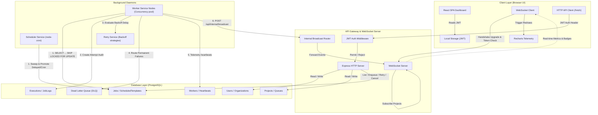

# System Architecture

The following diagram illustrates the monorepo architecture, showcasing data flow, security middleware boundaries, background daemon polling loops, and real-time WebSocket communication pathways.

---

## Component Details

### 1. Client Layer (Browser)

- **React SPA**: Renders the complete web interface (Login, Register, Dashboard, Job Explorer, Telemetry, and DLQ).
- **Recharts**: Dynamically plots metrics dashboards including Queue Throughput, Job Execution trends, Worker heartbeat telemetry, and Failure Rates.
- **WebSocket Client**: Subscribes to individual `projectId` streams and triggers components redraws upon receiving state change events.

### 2. API Gateway & WebSocket Server

- **Express Router**: Serves REST interfaces under `/api` with RBAC scopes.
- **JWT Middleware**: Intercepts requests, validates authorization headers, and injects user profile contexts.
- **WebSocket Upgrade Handler**: Performs security checks on HTTP connection handshakes (`?token=<token>`) and establishes real-time client pipes.
- **Internal Broadcast Route**: decodes status posts sent by background worker nodes and broadcasts them safely to authorized subscribers.

### 3. Background Processing Daemons

- **Scheduler Service**: Runs node-cron sweep timers to promote scheduled delayed queues and generate new recurring job instances while managing catch-up recoveries upon startup.
- **Worker Service**: Employs raw transaction queries (`FOR UPDATE SKIP LOCKED`) to claim queued jobs atomically. Implements task timeout AbortControllers and graceful signal terminations.
- **Retry Service**: Evaluates retry configurations (Fixed, Linear, Exponential) to calculate retry delays.

### 4. Database Layer (PostgreSQL)

- Provides structured tables mapped through **Prisma**. Indexes are established on execution filters (`status`, `queueId`, `projectId`, `batchId`) to guarantee fast retrieval at scale.
