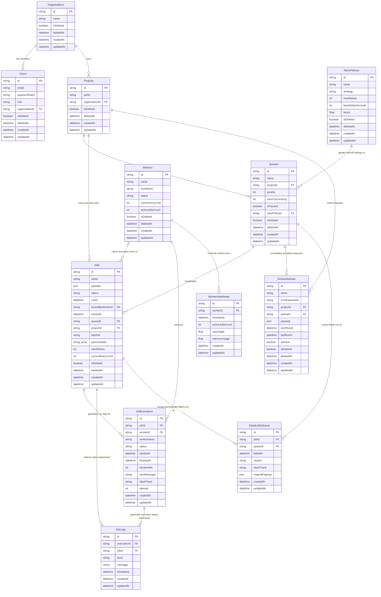

# Database Entity-Relationship Diagram

The following entity-relationship diagram shows the schema structure, column data types, index mappings, primary keys (PK), foreign keys (FK), and join constraints.

